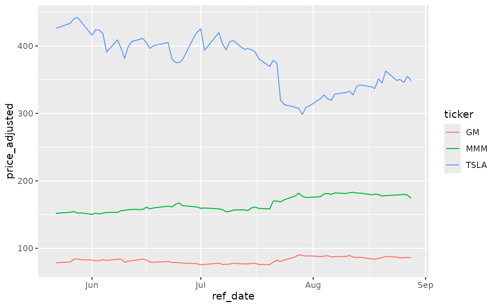
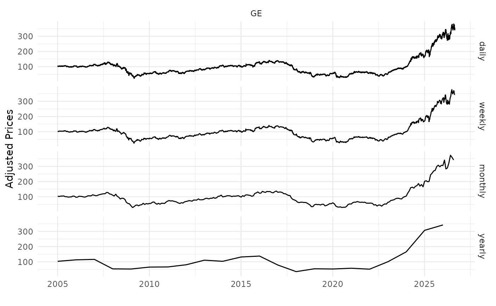

# Getting Started

## Examples

Here you’ll find a series of example of calls to
[`yf_get()`](https://docs.ropensci.org/yfR/reference/yf_get.md). Most
arguments are self-explanatory, but you can find more details at the
help files.

The steps of the algorithm are:

1.  check cache files for existing data
2.  if not in cache, fetch stock prices from YF and clean up the raw
    data
3.  write cache file if not available
4.  calculate all returns
5.  build diagnostics
6.  return the data to the user

### Fetching a single stock price

``` r

library(yfR)

# set options for algorithm
my_ticker <- 'GM'
first_date <- Sys.Date() - 30
last_date <- Sys.Date()

# fetch data
df_yf <- yf_get(tickers = my_ticker, 
                first_date = first_date,
                last_date = last_date)

# output is a tibble with data
head(df_yf)
```

    ## # A tibble: 6 × 11
    ##   ticker ref_date   price_open price_high price_low price_close  volume
    ##   <chr>  <date>          <dbl>      <dbl>     <dbl>       <dbl>   <dbl>
    ## 1 GM     2026-07-31       88.8       89.1      87.0        88.9 6678000
    ## 2 GM     2026-08-03       89.5       90.3      87.3        87.7 4813400
    ## 3 GM     2026-08-04       87.4       88.6      86.0        88.3 5329800
    ## 4 GM     2026-08-05       88.5       90.0      88.3        89.2 6860200
    ## 5 GM     2026-08-06       89.2       89.3      86.5        86.9 5431300
    ## 6 GM     2026-08-07       86.9       87.9      86.3        87.6 4024000
    ## # ℹ 4 more variables: price_adjusted <dbl>, ret_adjusted_prices <dbl>,
    ## #   ret_closing_prices <dbl>, cumret_adjusted_prices <dbl>

### Fetching many stock prices

``` r

library(yfR)
library(ggplot2)

my_ticker <- c('TSLA', 'GM', 'MMM')
first_date <- Sys.Date() - 100
last_date <- Sys.Date()

df_yf_multiple <- yf_get(tickers = my_ticker, 
                         first_date = first_date,
                         last_date = last_date)


p <- ggplot(df_yf_multiple, aes(x = ref_date, y = price_adjusted,
                                color = ticker)) + 
  geom_line()

p
```



### Fetching daily/weekly/monthly/yearly price data

``` r

library(yfR)
library(ggplot2)
library(dplyr)

my_ticker <- 'GE'
first_date <- '2005-01-01'
last_date <- Sys.Date()

df_dailly <- yf_get(tickers = my_ticker, 
                    first_date, last_date, 
                    freq_data = 'daily') %>%
  mutate(freq = 'daily')

df_weekly <- yf_get(tickers = my_ticker, 
                    first_date, last_date, 
                    freq_data = 'weekly') %>%
  mutate(freq = 'weekly')

df_monthly <- yf_get(tickers = my_ticker, 
                     first_date, last_date, 
                     freq_data = 'monthly') %>%
  mutate(freq = 'monthly')

df_yearly <- yf_get(tickers = my_ticker, 
                    first_date, last_date, 
                    freq_data = 'yearly') %>%
  mutate(freq = 'yearly')

# bind it all together for plotting
df_allfreq <- bind_rows(
  list(df_dailly, df_weekly, df_monthly, df_yearly)
) %>%
  mutate(freq = factor(freq, 
                       levels = c('daily', 
                                  'weekly',
                                  'monthly',
                                  'yearly'))) # make sure the order in plot is right

p <- ggplot(df_allfreq, aes(x = ref_date, y = price_adjusted)) + 
  geom_line() + 
  facet_grid(freq ~ ticker) + 
  theme_minimal() + 
  labs(x = '', y = 'Adjusted Prices')

print(p)
```



### Changing format to wide

``` r

library(yfR)
library(ggplot2)

my_ticker <- c('TSLA', 'GM', 'MMM')
first_date <- Sys.Date() - 100
last_date <- Sys.Date()

df_yf_multiple <- yf_get(tickers = my_ticker, 
                         first_date = first_date,
                         last_date = last_date)

print(df_yf_multiple)
```

    ## # A tibble: 204 × 11
    ##    ticker ref_date   price_open price_high price_low price_close   volume
    ##  * <chr>  <date>          <dbl>      <dbl>     <dbl>       <dbl>    <dbl>
    ##  1 GM     2026-05-22       78         79.8      77.7        78.8  6440900
    ##  2 GM     2026-05-26       79.3       80.2      78.7        79.8  5021700
    ##  3 GM     2026-05-27       80.7       84.5      80.7        84.1 10368600
    ##  4 GM     2026-05-28       83.6       85.2      83.4        84.3  7658000
    ##  5 GM     2026-05-29       84.8       85.0      81.2        83.2 15552600
    ##  6 GM     2026-06-01       83.4       83.4      80.4        82.7  7510600
    ##  7 GM     2026-06-02       82.9       84.2      81.0        81.7 10550800
    ##  8 GM     2026-06-03       80.7       84.1      80.3        81.7  9719500
    ##  9 GM     2026-06-04       82.1       83.6      81.6        83.2  6859300
    ## 10 GM     2026-06-05       82.0       83.1      81.4        82.1  7371600
    ## # ℹ 194 more rows
    ## # ℹ 4 more variables: price_adjusted <dbl>, ret_adjusted_prices <dbl>,
    ## #   ret_closing_prices <dbl>, cumret_adjusted_prices <dbl>

``` r

l_wide <- yf_convert_to_wide(df_yf_multiple)

names(l_wide)
```

    ## [1] "price_open"             "price_high"             "price_low"             
    ## [4] "price_close"            "volume"                 "price_adjusted"        
    ## [7] "ret_adjusted_prices"    "ret_closing_prices"     "cumret_adjusted_prices"

``` r

prices_wide <- l_wide$price_adjusted
head(prices_wide)
```

    ## # A tibble: 6 × 4
    ##   ref_date      GM   MMM  TSLA
    ##   <date>     <dbl> <dbl> <dbl>
    ## 1 2026-05-22  78.6  152.  426.
    ## 2 2026-05-26  79.6  153.  434.
    ## 3 2026-05-27  83.9  154.  440.
    ## 4 2026-05-28  84.2  152.  442.
    ## 5 2026-05-29  83.1  152.  436.
    ## 6 2026-06-01  82.5  150.  416.
